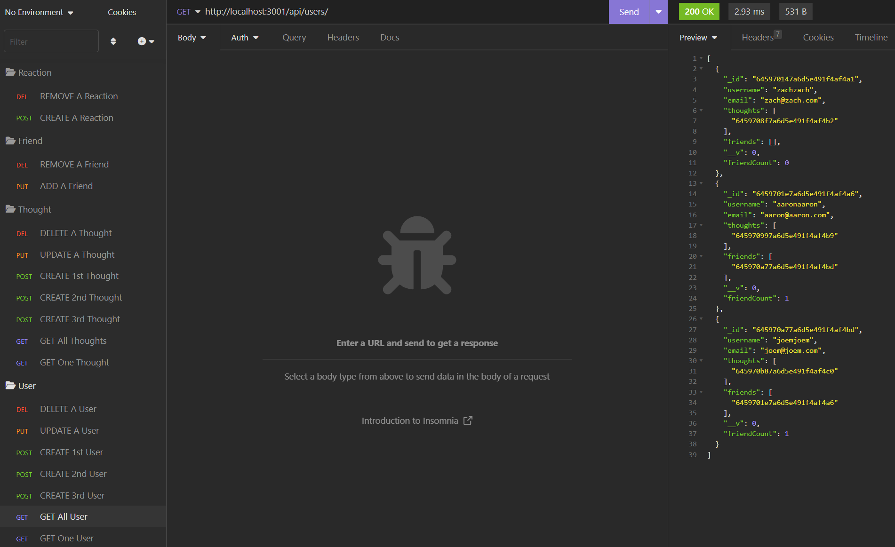

# **Tech-Blog**

  ## **Description**
  - An API used for a Social Network Web Application where users can share their thoughts, react to friends' thoughts, and create a friend list.

**Repository URL:** https://github.com/Animeet/Social_Network_API

**Video Demonstration URL:** https://www.youtube.com/watch?v=y3ohb8EmIcM

  ## Table of Contents
  - [Installation](#installation)
  - [Usage](#usage)
  - [Contribution](#contribution)
  - [Testing](#testing)
  - [MIT](https://opensource.org/licenses/MIT)
  - [Questions](#questions)

  ---

  ## **Installation**
  To install, please download the folder/repository through the github url above.

  ---

  ## **Usage Information**
  To use the application, you'll first want to copy over the repository from the url above.
  Next, you'll want a seperate application, such as Insomnia, to be able to test the utilization.
  Start your server, and follow the demonstration video for directions on how to use.

  ---
  
  ## **Contribution**
  This is an open source project. If you'd like to contribute, simply create a pull request.

  ---

  ## **Testing**
  Similar to the usage section, to test you'll want an application similar to Insomnia, to be able to utilize testing of everything within this repository.

  ---

  
   ## **License**
  License: MIT

  For more information on the license above, please go to [https://www.choosealicense.com/](https://www.choosealicense.com/).

  ---

  ## **Questions**
  If you have any questions about this repository, please contact me directly at [zachhsavage@gmail.com](mailto:zachhsavage@gmail.com).
  You can find this repository, and others I have worked on at [Animeet](https://www.github.com/Animeet).
